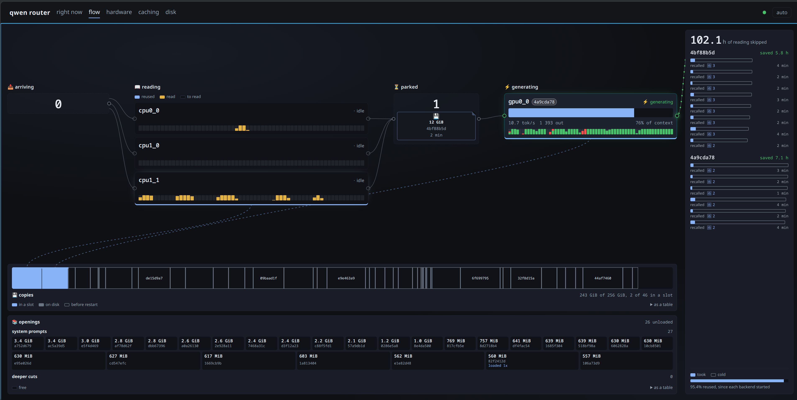

# llama-arbiter

A router that keeps a conversation's prompt cache warm.

llama.cpp already caches a prompt, but only while the conversation stays in a
slot. A second conversation takes that slot, and the first one must read its
whole prompt again. A long prompt takes about an hour to read. A cached one
continues in seconds.

So the built-in cache serves as many conversations as you have slots. Work on
more than that, and every switch back costs a full read.

This router gives a cache to every conversation, not only to the ones that fit:

- It copies each cache to disk before anything can displace it.
- It restores that cache when the conversation comes back.
- It sends each turn to the slot that already holds its cache.
- It saves the system prompt that every new session starts from.

On the machine these defaults came from, 4 slots serve 47 conversations. The
prefilling backends reuse 95.6% of all prompt tokens.

The **flow** view of the dashboard. A turn moves from left to right. Below it,
the page shows every cache on disk against its budget, and the saved openings
that a new session starts from.

    ./start-all.sh      start the backends and the router
    ./stop-all.sh       stop them

    http://<host>:8090/v1            openai
    http://<host>:8090/v1/messages   anthropic
    http://<host>:8090/v1/systemone  typed questions
    http://<host>:8090/router        dashboard

## Typed questions

Not every question needs a reply written out. `/v1/systemone` takes a state and
one or more typed questions, and answers each one with a single token and the
probabilities behind it. The field names are TypeSafe's Jev, so a client
written for that API reaches this router by changing the base URL.

    POST /v1/systemone
    {
      "state": "cpu1_0 read 150000 tokens in 94 minutes",
      "questions": {
        "kind": {
          "type": "choice",
          "instructions": "What happened to this turn?",
          "criteria": {"warm": "it reused a cache",
                       "cold": "it read from the start",
                       "lost": "it never reached a backend"}
        }
      }
    }

    {
      "answers": {
        "kind": {"type": "choice", "choice": "cold",
                 "probabilities": {"warm": 0.04, "cold": 0.93, "lost": 0.03},
                 "confidence": 0.93, "mass": 0.88}
      },
      "usage": {"input_tokens": 88, "output_tokens": 1},
      "router": {"backend": "cpu1_0", "read": 12, "reused": 76, "took": 1.9,
                 "questions": [{"question": "kind", "read": 4, "reused": 84}]}
    }

Three types of question:

| `type` | `criteria` | what comes back |
|---|---|---|
| `choice` | an object of answer name to what it means | `choice`, the name that won |
| `score` | a list of levels, lowest first | `score`, the expected level, so it lands between them |
| `noul` | none | `noul`, the probability that the answer is yes |

The router gives every answer a letter, asks for one token, and maps the letter
back to the name. One token carries 26 answers at most, and it refuses more.

`state` is text, or any json value. A client usually holds a record rather than
a paragraph, so an object is rendered once and every question is asked about
the same rendering. A `noul` may carry `criteria` as well: it still answers yes
or no, and the two entries say what yes and no stand for.

`confidence` is the top probability, scaled so the answers sum to one. It is
not calibrated: a higher number has not been shown to mean a higher chance of
being right. Read it as a margin against the runner-up, not as a percentage.

`mass` is what those answers held **before** that scaling. The grammar decides
which token is written, but the probabilities llama.cpp reports are a plain
softmax taken before it, over the whole vocabulary. So they include words no
answer stands for, and the router drops those and scales up what is left.

Read `mass` first. Near 1 the model was answering the question. Near 0 it was
going to write something else, the grammar made it write a letter anyway, and
the probabilities above are the little that was left. How near either end a
given model sits is the model's own business; what moves it most is whether
the chat template is reasoning. The router asks for thinking off, and a model
whose template ignores that will report a mass near zero.

A call may carry several questions. The state is read once, and each question
is asked against the slot that already holds it, so a question costs its own
words and one token rather than another reading of the state.
`router.questions` says what each one cost, by the backend's own count, which
is the number to look at rather than any figure written here.

Try them on the dashboard's **try it out** page first.

Two things to know before sending a large state:

- The reply is not streamed, and nothing is sent until every question is
  answered. A state of a hundred thousand tokens reads for as long as any other
  prompt of that size, so give the client a long timeout.
- The turn queues like any other. It is not allowed to skip ahead, because how
  long it will take is not knowable before its state is read.

## What it needs

### A patched llama.cpp

Three of the patches in `patches/` are required. The router does not work
without them:

| patch | what it makes possible |
|---|---|
| `slot-state-carries-checkpoints` | A restored slot can be extended without a re-read. |
| `slots-report-the-prompt-size` | The dashboard can compute "still to read". |
| `anthropic-pass-id-slot` | The router can name a slot on `/v1/messages`. |

To clone llama.cpp, apply the patches and build the server, run:

    tools/get-llama.sh

The script builds `llama-server` at the path that `SERVER_MTP` uses by default.
A machine with an nvidia card needs no further configuration for it. Three
variables change what the script does:

- `BUILD=0` stops before cmake.
- `CUDA=0` and `CMAKE_ARGS` build it another way.
- `LLAMA_REF` pins an upstream commit, if the tip has moved under the patches.

Run the script again at any time. It skips a patch that is already applied.

The launch scripts also pass `--agent`, `--no-cache-idle-slots`,
`--ctx-checkpoints`, `--checkpoint-min-step`, `--n-cpu-moe` and `--spec-type
draft-mtp`. A build that is too old for these flags does not start.

### Weights

Keep the weights anywhere. Name them with `MODELS` and `MODEL_Q8` in
`config.local.sh`. By default those names point to Qwen3-Next at Q8, with an
MTP draft model and an F16 mmproj. Nothing else in this repository depends on
that model.

## Running it elsewhere

Copy `config.local.example.sh` to `config.local.sh`. Git does not track that
file, and every launch script reads it first. Set what differs on your machine:

- where llama-server is
- where the weights are, and what they are called
- how much context each slot gets (`CTX`)
- how the model divides between card and RAM (`NGL`, `N_CPU_MOE`)
- threads per backend
- which disk holds the saved openings (`BLOCK_DIR`)
- where a run writes (`RUN`)

Check `CTX` first. The default of 150000 fits 16 GiB of VRAM at f16 KV. Every
backend must use the same number, because a conversation that outgrows one
backend can never move back to it.

By default the router starts one `llama-server` on :8080. That instance both
prefills and generates. A single instance needs no further configuration.

For more than one instance, set two tables and keep them in step:

- `BACKENDS` in `config.local.sh` names what `start-all.sh` starts,
  `stop-all.sh` stops and `bin/restart-backend.sh` restarts. Write one
  `name port script [VAR=…]` a line.
- `ROUTER_BACKENDS` names a JSON file. It holds the same set, plus `prefill`,
  `generate` and `pref`. `pref` orders where a turn generates, lowest first.

To prefill is to read a prompt. That work is compute bound, and it runs for
tens of minutes. To generate is to write the reply. That work is memory bound,
and it runs for seconds. The two are separate settings, because an instance can
be good at one, at the other, or at both:

| `prefill` | `generate` | what the instance is |
|---|---|---|
| true | true | It reads and answers in the same slot. One instance wants this. |
| false | true | A **generator**. Turns migrate here after another instance reads the prompt. |
| true | false | It reads for the pool. It hands on every turn, and never spends a slot on a reply. |

Hardware does not decide this. For example, the machine these defaults came
from sets `prefill: false` on the instance that holds the GPU. That card
prefilled no faster than a cpu socket, but it generated five times faster. A
machine whose card is also its fastest prefiller leaves both settings on.

The router refuses three tables at startup, rather than at the turn that first
needs them:

- a table where nothing prefills
- a table where nothing generates
- a table that holds an instance which does neither

At startup the router prints which table it loaded, and where it read it from.

The backends run with `--agent`. That flag gives any client shell access and
file access, and there is no API key. Therefore the backends listen on
localhost only. The router is the public port. It serves the two chat APIs and
a short list of endpoints that a client asks about itself, and it refuses the
rest. `PASS_THROUGH` adds to that list. Do not put a backend on a public
address.

## Tests

    python3 -m unittest discover -s tests -p "test_*.py"

    cd bin/web && npm install       # once: typescript, for the type gate
    node tools/check.mjs

`tests/live/` starts real `llama-server` processes instead of a test double. It
asserts only on what a backend reports about itself. Its README says why, and
lists what those tests found.

## How it behaves

- A conversation has one pin, one slot and one copy on disk. One turn runs at a
  time, and the next turn waits, because two turns move the same three things.
- A prompt under `PARK_MIN_TOKENS` is read again rather than copied. A copy
  costs about the same however little it holds, so a short one buys seconds
  and spends hundreds of megabytes. A copy still carries a turn to the
  instance that generates it, whatever its size: that copy is transport.
- The copies share one budget. When it is full, the ones that go are the ones
  earning least: the tokens a copy saves reading again, times the turns that
  have asked for them, over its size. A question asked once and never returned
  to goes before a conversation in daily use, however recently it was written.
  The copy just written is never the one dropped.
- A read sends nothing for tens of minutes. The router holds the stream open
  with the keep-alive of that protocol: a comment for OpenAI, a `ping` event
  for anthropic.
- The router names a conversation from `x-claude-code-session-id` or
  `prompt_cache_key`. If a request carries neither, it hashes the start of the
  prompt.
- `SIGTERM` parks every live cache first. `stop-all.sh` stops the router while
  the backends still run, so that the router can read from them.
- The router writes each cache decision to `run/cache-events-*.jsonl`. Read
  them with `tools/cache-report.py`. `CACHE_LOG=0` turns them off.
- To restart one backend, run `bin/restart-backend.sh <name>`. To restart the
  router, run `bin/restart-router.sh`. Both read `config.local.sh` first. A
  server that you start by hand does not read it, and it uses the built-in
  defaults instead.
- If the router is slow, read `run/*.log` or run `tools/watch.sh`. A backend
  that re-reads its weights from disk stays in D state, at a tenth of its
  speed.

The dashboard builds Claude Code and OpenCode configuration files under **client
setup**. It uses the address that you reached the dashboard on.

`bin/router/` is the router, and its docstrings are the reference. Start at
`__init__.py`: it lists the modules in the order a turn meets them.
`docs/LAYOUT.md` gives the measurements behind the defaults above. It also says
which of those defaults are properties of llama.cpp, and which are properties
of one machine.
